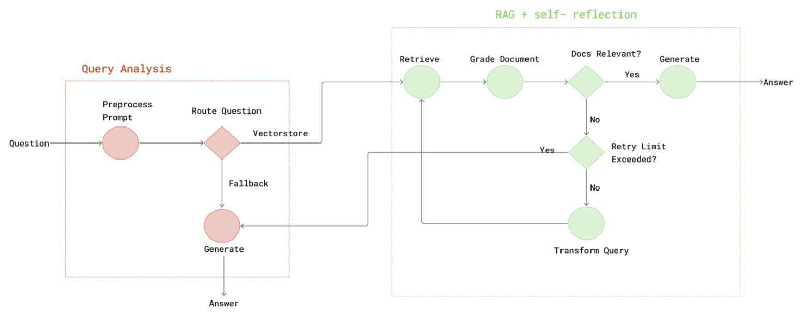
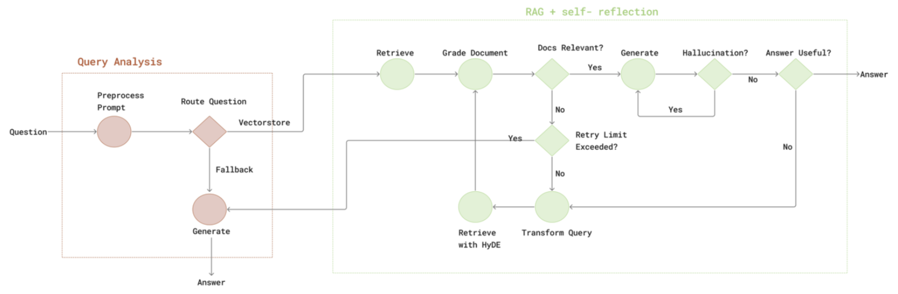
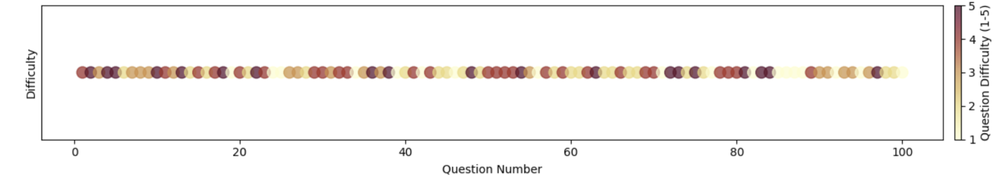

# Linguify Self-Reflective (SR)-RAG Agent Architecture System

Our novel Self-Reflective (SR)-RAG enables better instruction-tuning and Query-routing for our Large Language Model (LLM) system designed to generate human-like responses to text prompts. This repository provides the code and necessary steps for setting up and using the SR-RAG LLM agent.

> [!NOTE]
> All architectures, frameworks, pipelines, models, and preprocessed datasets proposed are completely researched, designed, and implemented with complete success by the authors (Joseph Chay and Leong Tin Jet).

---

## Trained Models Files and Versions

For our agent model assets, config files, and versions, supplemented with usage 
implementation guides, refer to [Hugging Face model hub](https://huggingface.co/josephchay/Linguify).

---



Our LLM SR-RAG pipeline functions through two main components (a) Query
Analysis phase implements preliminary processing and routing logic, where
incoming questions undergo prompt preprocessing followed by conditional
routing to either retrieve from the vectorstore or employ direct generation fall-
back. (b) RAG with self-reflection component illustrates the iterative retrieval-
evaluation-generation pipeline, featuring document relevance assessment and
query transformation mechanisms when initial retrieval yields insufficient con-
text. The bidirectional arrows represent information flow between components,
with dashed outlines indicating decision points that determine subsequent
processing paths during inference.



We  initially  proposed  an  improved  Retrieval-AugmentedGeneration  (RAG)  workflow  with  LangGraph . 
The  system  featured  a  query  routing  component  to  direct questions  to  domain-specific  knowledge  sources,  and  a 
document  filtering  mechanism  to  eliminate  irrelevant  content. 
This  architecture  included  self-reflective  components  for hallucination  detection  and  answer  quality  assessment,
in-spired  by  recent  works on  model  self-evaluation.  
We also  experimented and evaluated  with  Hypothetical  Document  Embeddings (HyDE) 
as an alternative retrieval strategy which includes these components:
1. Dual  self-reflection  components: We employ both hal-lucination  detection H(a,{di}) →  [0, 1]  and  answer  useful-ness  evaluation U (a,q) →  [0, 1]  where a  is  the  generatedanswer,  enabling  iterative  refinement  when H(a,{di}) > τhor U (a,q) < τu[16].
2. Enhanced  HyDE  integration: We generate a hypothet-ical document h = M (q) based on the query, and incorporateit in the retrieval process with R(E(h),D) where E() is theembedding function [68].However,  further  implementation  revealed  significant  limi-tations:•  LLaMA 3.2B model’s restricted context window provedinadequate for effective self-reflection.•  HyDE consistently underperformed compared to standardretrieval methods in our call center domain.Hence,  these  findings  led  to  the  development  of  our  pro-posed novel SR-RAG in Figure 1, completely eliminating theselimitations while enhancing the architecture’s performanc

## Results and Discussions


Our proposed optimized SR-RAG architecture demonstrated
exceptional performance across 100 diverse queries, achieving
an answer relevancy score of 0.94 and faithfulness score of
0.92. After minimal initial volatility,
both metrics quickly stabilized, with relevancy consistently
outperforming faithfulness by a small margin (1-2%). The
high faithfulness score in a domain where factual accuracy is
critical for customer trust and compliance demonstrates
our architecture’s effectiveness for knowledge-intensive call
center chatbot service applications.



The scatter plot visualizes the question difficulty distribution across 100 evaluation prompts, 
demonstrating the implementation of a random sampling methodology for our 
SR-RAG LLM evaluation. Each dot represents 
a question, with colors ranging from light yellow (difficulty level 1) to dark burgundy (difficulty level 5). 
The visualization confirms that our evaluation utilized a truly randomized selection process rather than manually curated samples, as evidenced by the natural variance and unpredictable pattern of difficulty levels across the question sequence. This random distribution approach aligns with modern evaluation best practices that recommend "closing the gap between evaluation data and real-world data with random sampling", helping eliminate potential selection bias that could artificially inflate performance metrics. 

The balanced presence of various difficulty levels throughout the question set ensures our evaluation provides a more realistic assessment of the system's capabilities across diverse scenarios, validating that our integrated SR-RAG and CHASM-TTS module can indeed maintain high performance scores even when facing randomly selected challenging questions.

## Evaluation and Testing Results


The domain-specific analysis in the above evaluation diagram demonstrates
the adaptability and versatility of Linguify across different
conditions and decision-makings. Overall, medical domains
achieved higher relevancy scores (0.94 average) compared to
finance (0.89), while finance domains demonstrated superior
faithfulness (0.92 versus 0.83 for medical). This pattern may
reflect differences in the nature of knowledge between domains - medical information often requires more interpretive
understanding, while financial information tends to be more
precise and rule-based. Henceforth, showing a strong strength of our SR-RAG architecture in 
versatile to adaptability and performance across various domains.

## Setup & Development

Follow the instructions below to set up the LinguifyChat LLM system on your local environment.

### 1. Clone the Repository

Start by cloning the repository to your local machine:

```bash
git clone https://github.com/josephchay/linguify.git
```

```bash
cd linguify/LLM
```

### 2. Install Dependencies

After cloning the repository, install the required dependencies:

```bash
pip install -r requirements.txt
```

This will install all the necessary libraries and packages for the project.

## Workflow

The LinguifyChat system consists of three main stages: scraping, indexing, and testing the RAG pipeline. Follow these steps sequentially to run the system.

### 1. Scrape the Website

Run the `lhdn-scrapper.ipynb` notebook to scrape the relevant data from the target website. This will collect the information needed for the LLM system.

To run the notebook, use the following command:

```bash
jupyter notebook lhdn-scrapper.ipynb
```

### 2. Run the Indexing Process

Once the data is scraped, run the `indexing.ipynb` notebook to index the scraped data. This process prepares the data for use in the LLM system.

```bash
jupyter notebook indexing.ipynb
```

### 3. Test the RAG Pipeline

Finally, test the Retrieval-Augmented Generation (RAG) pipeline by running the `llm.ipynb` notebook. This will validate that the system is working as expected.

```bash
jupyter notebook llm.ipynb
```

## Advanced Usage and Model Components

### Self-Reflective Diffusion Processing

Our SR-RAG model leverages advanced diffusion techniques for robust text generation. Here's how to use the diffusion components:

```python
from linguify.modeling.gaussian_diffusion import GaussianDiffusion
from linguify.modeling.timestep_sampler import UniformSampler

# Initialize the diffusion model for text conditioning
diffusion_model = GaussianDiffusion(
    betas=(1e-4, 0.02),
    model_mean_type="epsilon",
    model_var_type="fixed_small",
    loss_type="mse"
)

# Create a timestep sampler for the diffusion process
sampler = UniformSampler(num_timesteps=1000)
timesteps = sampler.sample(batch_size=4, device="cuda")

# Generate conditioned text with noise
noised_embeddings = diffusion_model.q_sample(
    x_start=text_embeddings,
    t=timesteps,
    noise=torch.randn_like(text_embeddings)
)

# Run reverse diffusion process to generate improved text
generated_text = diffusion_model.p_sample_loop(
    model=language_model,
    shape=text_embeddings.shape,
    noise=torch.randn_like(text_embeddings),
    clip_denoised=True,
    model_kwargs={"context": retrieved_documents}
)
```

### Custom Reflection Mechanism

The core of our SR-RAG implementation is the reflection mechanism that improves response quality:

```python
from linguify.modeling.reflection import SelfReflectiveAttention, ReflectionController

# Initialize the reflection components
reflection_attn = SelfReflectiveAttention(
    embed_dim=768,
    num_heads=12,
    dropout=0.1
)

reflection_controller = ReflectionController(
    reflection_threshold=0.7,
    max_reflection_rounds=3
)

# Generate initial response
initial_response = rag_model.generate(query, retrieved_docs)

# Apply reflection mechanism to improve response
reflection_results = reflection_controller.reflect(
    query=query,
    initial_response=initial_response,
    retrieved_docs=retrieved_docs,
    confidence_score=confidence
)

if reflection_results["needs_refinement"]:
    # Apply attention to focus on key context elements
    refined_context = reflection_attn(
        query_embed=query_embedding,
        response_embed=initial_response_embedding,
        context_embeds=document_embeddings
    )

    # Generate improved response with refined context
    final_response = rag_model.generate(
        query,
        refined_context,
        use_reflection=True
    )
else:
    final_response = initial_response

print(f"Final response: {final_response}")
print(f"Required {reflection_results['reflection_rounds']} reflection rounds")
```

### Document Information Transformer (DIT) Inference

The DIT model can be used for inference with our pre-trained weights. Here's a sample usage pattern from our `dit_inference.ipynb`:

```python
# Example code from dit_inference.ipynb
import torch
from linguify.models.dit import DocumentInformationTransformer
from linguify.utils.tokenization import LinguifyTokenizer

# Load pre-trained DIT model
model = DocumentInformationTransformer.from_pretrained("linguify/dit-base")
tokenizer = LinguifyTokenizer.from_pretrained("linguify/tokenizer")

# Prepare query and retrieved documents
query = "How do I calculate my income tax in Malaysia?"
documents = retriever.get_relevant_documents(query, k=5)

# Format documents for the model
formatted_docs = []
for doc in documents:
    formatted_docs.append({
        'content': doc.page_content,
        'source': doc.metadata.get('source', 'unknown'),
        'relevance_score': doc.metadata.get('score', 0.0)
    })

# Tokenize inputs
inputs = tokenizer.prepare_dit_input(
    query=query,
    documents=formatted_docs,
    max_length=1024,
    return_tensors="pt"
)

# Generate response with self-reflection
with torch.no_grad():
    outputs = model.generate(
        **inputs,
        max_length=512,
        num_beams=4,
        temperature=0.7,
        no_repeat_ngram_size=3,
        use_self_reflection=True,
        reflection_rounds=2
    )

response = tokenizer.decode(outputs[0], skip_special_tokens=True)
print(f"DIT Response: {response}")
```

### Batch Processing with Temporal Fusion

For handling multiple queries efficiently with our diffusion-based models:

```python
from linguify.diffusers.pipeline import SR_RAG_Pipeline
from linguify.diffusers.temporal_fusion import TemporalFusionEncoder

# Initialize the pipeline
pipeline = SR_RAG_Pipeline.from_pretrained("linguify/sr-rag-v1")
fusion_encoder = TemporalFusionEncoder(
    input_dim=768,
    hidden_dim=1024,
    output_dim=768,
    num_layers=3
)

# Process multiple queries
queries = [
    "What are the income tax brackets in Malaysia?",
    "How do I register as a taxpayer?",
    "What deductions are available for individuals?"
]

# Prepare query embeddings
query_embeddings = pipeline.encode_queries(queries)

# Apply temporal fusion for context-aware processing
fused_embeddings = fusion_encoder(
    query_embeddings,
    temporal_context=True,
    sliding_window=2
)

# Process in batch
results = pipeline.batch_process(
    queries,
    embeddings=fused_embeddings,
    max_workers=3,
    use_diffusion=True,
    diffusion_steps=250
)

# Display results with confidence scores
for query, result in zip(queries, results):
    print(f"Q: {query}")
    print(f"A: {result['response']}")
    print(f"Confidence: {result['confidence']:.2f}")
    print(f"Reflection rounds: {result['reflection_info']['rounds']}")
    print("-" * 50)
```

## License

This project is licensed under the MIT License - see the [LICENSE](../LICENSE.txt) file for details.

## Features & Updates

Refer to the [CHANGELOG](CHANGELOG.md) file for the thorough latest updates and features of Linguify.

## Research Documentation Paper

For comprehensive information about our implementation details, methodology, and findings, please refer to our [research documentation](documentation.pdf) which thoroughly documents everything we've accomplished in this codebase.

## Citation

If you use this project in your research or application, please cite:

```bibtex
@inproceedings{chayleong2025linguify,
  author = {Joseph Chay and TinJet Leong},
  title = {Linguify: Self-Reflective Retrieval-Augmented Generation and
Chunk-Aware Streaming Modular TTS for Interruptable, Low-Latency
Chatbot Conversational AI},
  year = {2025},
  url = {https://github.com/josephchay/Linguify}
}
```

## Contact

For questions, suggestions, or issues related to this project, please contact the creators through [Hugging Face](https://huggingface.co/josephchay/Linguify) or open an issue in our GitHub [repository](https://github.com/josephchay/linguify).
