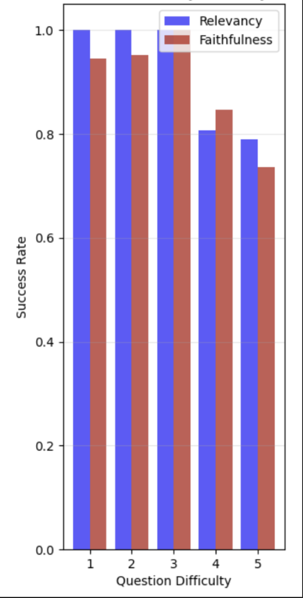

# Linguify – The Future of Chatbot Conversational AI

_Novel Approach: Self-Reflective Retrieval-Augmented Generation (SR-RAG) and Chunk-Aware Streaming Modular Text-to-Speech (CHASM-TTS) for Interruptable, Low-Latency Chatbot Conversational AI_

**Pushing the boundaries of AI-driven automated conversations for call centers.**

Unlock the power of seamless communication with Linguify, the next-generation 
call center AI chatbot that speaks just like a human - fascinatingly even more.
Designed with advanced sentiment analysis and deep understanding of human psychology,
Linguify goes beyond basic chatbot responses. It listens, understands emotions, and responds naturally,
creating meaningful conversations that build trust and satisfaction.

Whether it's handling complex queries, guiding users with empathy, or delivering personalized experiences,
Linguify adapts to every situation with unparalleled fluency.
Empower your business with the most human-like conversational AI,
and redefine customer interactions with intelligence, care, and precision.

_Linguify – Because Chatbot Conversations Should Resonate._

---

> [!NOTE]
> We include even more detailed documentation, usage implementation, code guides with explanations, and results, evaluations, testings discussions for [Dataset Preprocessing, Cleaning, and Segregation README](preprocessing/README.md), [Self-Reflective (SR)-RAG README](LLM/README.md) and [Chunk-Aware Streaming Modular (CHASM)-TTS README](TTS/README.md) respectively in their `README.md` files.

## Curated Resources

### Trained Models Files and Versions

For our agent model assets, config files, and versions, supplemented with usage 
implementation guides, refer to [Hugging Face model hub](https://huggingface.co/josephchay/Linguify).

### Preprocessed, Cleaned, Segregated Dataset

For our own curated datasets, files and versions of over 30 million rows, 
supplemented with usage implementation guides, refer to [Hugging Face model hub](https://huggingface.co/josephchay/Linguify).

> [!NOTE]
> All architectures, frameworks, pipelines, models, and preprocessed datasets proposed are completely researched, designed, and implemented with complete success by the authors (Joseph Chay and Leong Tin Jet).

---

## Experiment Setups

Linguify's [data preprocessing, cleaning, and segregation pipeline](Preprocessing/README.md) enables efficient transformation of raw data from multiple sources into structured, high-quality training datasets for conversational AI. The pipeline incorporates web scraping tools for collecting domain-specific information, intelligent text processing for preserving semantic meaning, and vector embedding generation for knowledge retrieval. This comprehensive approach allows Linguify to build specialized knowledge bases in financial and tax domains, ensuring the resulting AI system can deliver accurate, context-aware responses while maintaining natural conversational flow. For complete technical specifications, implementation details, and usage examples of our dataset pipelining, refer to the dedicated [Preprocessing documentation](Preprocessing/README.md).

### Data Preprocessing


Linguify's data preprocessing pipeline transforms raw content from multiple sources into structured formats optimized for AI training. For web content, specialized scrapers extract information from financial and tax authority websites, preserving structural elements like tables while capturing semantic relationships between content sections. The system processes Hugging Face datasets from finance domains (such as finance-alpaca and causal-lm/finance) and medical collections (including medalpaca and PubMedQA) through format-specific transformers. Online datasets undergo consistent tokenization and normalization, with domain-specific terminology preserved. All content is segmented into semantically coherent chunks using recursive splitting techniques with appropriate overlap to maintain context integrity across document boundaries.

### Data Cleaning and Segregation


The cleaning and segregation phase ensures data quality and domain relevance across all sources. For web content, the pipeline filters out navigational elements, advertisements, and irrelevant sections while preserving hierarchical relationships in tax regulations and medical guidelines. Structured data from financial statements undergoes specialized table processing to maintain numerical relationships. Medical terminology is standardized through domain-specific dictionaries, and finance datasets are filtered to ensure regulatory compliance and accuracy. The system segregates content by domain, organizing it into specialized collections within vector databases for taxation regulations, financial advisories, and medical information. This domain-aware architecture ensures Linguify can deliver contextually appropriate responses with the correct regulatory and technical specificity for each domain.

## Model Agents & Architecture Systems

### Text to Speech (TTS)


Linguify's [Chunk-Aware Streaming Modular (CHASM)-TTS Model](TTS/README.md) model is a cutting-edge neural network designed to transform text into highly natural,
human-like speech with exceptional clarity and expression.
For complete technical specifications, implementation details, and usage examples of our speech comprehension and synthesis system, refer to the dedicated [TTS documentation](TTS/README.md).


To enable streaming synthesis, which allows real-time, inter-
ruptable speech generation as text is being received, four spe-
cialized attention mask types are strategically implemented in
the model architecture. They control the information
flow within the attention mechanisms of the Transformer-based
components, creating different trade-offs between interruptable
and synthesis quality. The mask selection directly affects how
much future context each frame can access during generation:

- Non-causal Mask: Attends to all frames for offline mode 
- Full-causal Mask: Attends only to past frames for lowest
latency 
- Chunk-M Mask: Attends to past and M future frames 
- Chunk-2M Mask: Extends context for better quality at
higher latency

### Large Language Model (LLM)


Linguify's [Self-Reflective (SR)-RAG](LLM/README.md) is an advanced conversational AI built as an intelligent retrieval and reasoning layer on top of a large language model (LLM), enhancing its ability to deliver highly precise, human-like responses with remarkable depth. For comprehensive information about our LLM architecture, pipelining, advanced usage patterns, and data storage vectorization, please consult the detailed [LLM documentation](LLM/README.md).


The initial Retrieval-Augmented Generation (RAG) workflow utilized LangGraph with specialized components to enhance performance 
and accuracy. This architecture incorporated query routing to direct questions to domain-specific 
knowledge sources, document filtering to remove irrelevant content, and dual self-reflection mechanisms for quality control. The system implemented both hallucination detection (H(a,{di}) →) and answer usefulness evaluation (U(a,q) →), enabling iterative refinement when predefined thresholds were exceeded. Additionally, the team experimented with Hypothetical Document Embeddings (HyDE) to generate hypothetical documents (h = M(q)) based on queries to improve retrieval precision. However, implementation revealed significant limitations: the LLaMA 3.2B model's restricted context window proved inadequate for effective self-reflection, while HyDE consistently underperformed in call center applications. These findings ultimately led to the development of a novel Self-Reflective RAG architecture that eliminated these limitations while enhancing overall performance.

## Results and Discussions


Our proposed optimized SR-RAG architecture demonstrated
exceptional performance across 100 diverse queries, achieving
an answer relevancy score of 0.94 and faithfulness score of
0.92. After minimal initial volatility,
both metrics quickly stabilized, with relevancy consistently
outperforming faithfulness by a small margin (1-2%). The
high faithfulness score in a domain where factual accuracy is
critical for customer trust and compliance demonstrates
our architecture’s effectiveness for knowledge-intensive call
center chatbot service applications.


The scatter plot visualizes the question difficulty distribution across 100 evaluation prompts, 
demonstrating the implementation of a random sampling methodology for our 
SR-RAG LLM and CHASM-TTS evaluation. Each dot represents 
a question, with colors ranging from light yellow (difficulty level 1) to dark burgundy (difficulty level 5). The visualization confirms that our evaluation utilized a truly randomized selection process rather than manually curated samples, as evidenced by the natural variance and unpredictable pattern of difficulty levels across the question sequence. This random distribution approach aligns with modern evaluation best practices that recommend "closing the gap between evaluation data and real-world data with random sampling", helping eliminate potential selection bias that could artificially inflate performance metrics. 

The balanced presence of various difficulty levels throughout the question set ensures our evaluation 
provides a more realistic assessment of the system's capabilities across 
diverse scenarios, validating that our integrated Linguify module 
can indeed maintain high performance scores even when facing randomly selected challenging questions.


Our accuracy curves results, clearly showing that the SID layer
representations provides strong evidence of the tokenizer’s
success in decoupling speaker information from speech content, 
essential for zero-shot synthesis systems where voice characteristics 
should be controlled independently from speech
content, which is supported by recent works.

## Evaluations and Testings
<div align="center">

</div>
Based on the evaluation results shown in the graph, Linguify demonstrates 
impressive performance across varying question difficulty levels. 
The system maintains perfect or near-perfect relevancy scores of 1.0 for questions at difficulty levels 1-3, indicating exceptional accuracy in retrieving and generating appropriate responses for standard queries. Even as question complexity increases to levels 4 and 5, the system sustains remarkably high relevancy scores of approximately 0.81 and 0.79 respectively.

Faithfulness metrics follow a similar pattern, with consistently high scores around 0.93-0.95 for lower difficulty questions. For the most challenging questions (level 5), the system still achieves a faithfulness score of 0.73, demonstrating its ability to maintain factual accuracy even when handling complex queries.

This performance data validates that our integrated SR-RAG and CHASM-TTS architecture successfully preserves high-quality outputs across the difficulty spectrum, with only modest degradation for the most challenging questions. The system's ability to maintain such robust performance metrics even at higher difficulty levels highlights the effectiveness of the self-reflective components and chunk-aware streaming mechanisms in handling complex conversational scenarios.


The domain-specific analysis in the above evaluation diagram demonstrates
the adaptability and versatility of Linguify across different
conditions and decision-makings. Overall, medical domains
achieved higher relevancy scores (0.94 average) compared to
finance (0.89), while finance domains demonstrated superior
faithfulness (0.92 versus 0.83 for medical). This pattern may
reflect differences in the nature of knowledge between domains - medical information often requires more interpretive
understanding, while financial information tends to be more
precise and rule-based. Henceforth, showing a strong strength of our SR-RAG architecture in 
versatile to adaptability and performance across various domains.


The t-SNE evaluations visualization illustrates the speech representations before
(a) and after (b) quantization for three different speakers from the dataset.
(c) presents the codebook utilization, displaying the token percentage across
speakers, with each bin containing 500 tokens.


To evaluate real-time adaptability, Linguify was tested across 
specialized and general domains, with results presented in Table I. The evaluation
used the metrics: accuracy, precision, recall, F1-score, domain
coverage, and hallucination rate.
Linguify demonstrated superior performance in specialized
domains compared to general content. Finance (Tax) domain
achieved the highest accuracy (93.5%) and F1-score (93.0%),
with a low hallucination rate of 3.2%. Medical domain fol-
lowed closely with 91.8% accuracy and 90.9% F1-score. The
general domain showed notably lower performance across all
metrics, with 82.4% accuracy and a higher hallucination rate
of 8.7%

### Ablations Studies and Benchmarking


Further evaluation was conducted on the commonly-used
SEED test sets: test-en (English), and test-hard (challenging cases). 
As shown in Table above, on the test-en set, it ranked
fourth in WER (2.57%) and third in SS (0.736), as other models are 
trained for longer durations and better GPU hardware. 
Considering ours was only trained for a total of 504 hours. On the challenging
test-hard set, the model achieved SOTA performance with a
WER of 6.83% and SS of 0.776, demonstrating robustness in
difficult synthesis scenarios.

### User Acceptance Testing


User Acceptance Testing (UAT) was conducted on Linguify
with 12 participants evaluating Linguify across three developmental stages (100, 500, and 1500
epochs), using a 10-point likert-scale. The evaluation assessed
five key metrics (shown as different colored bars in the above figure): 
1. Chatbot responsiveness
2. Information accuracy
3. Naturalness of interactions
4. Query comprehension
5. Overall satisfaction.

Scores show substantial improvement across all evaluation 
metrics throughout training, progressing from inadequate
ratings at 100 epochs (1.34-1.50) to significantly higher scores
at 500 epochs (2.38-4.26), and ultimately achieving excellent ratings at 1500 epochs (7.52-7.90). Response accuracy
consistently received higher scores across all training stages.
The non-linear quality improvement curve-with a dramatically larger average increase
between 500 and 1500 epochs (5.05 points) compared to
between 100 and 500 epochs (1.41 points).

The UAT results demonstrated Linguify’s superior ability to
maintain conversational coherence across multiple interactions
and adapt response styles based on detected user sentiment,
with participants specifically noting improved experiences
during scenarios simulating frustration or technical confusion.

## Package Installation

To use this as a package, install the latest version directly from the repository:

```bash
pip install git+https://github.com/josephchay/linguify.git
```

If you only need the Text-to-Speech or Large Language Model functionality, you can install it separately instead as guided in [TTS](TTS/README.md)
or [LLM](LLM/README.md) respectively.

## Setup & Development

For development and contribution, clone the repository:

```bash
git clone https://github.com/josephchay/linguify.git
cd linguify
```

Install the package in editable mode:

```bash
pip install -e .
```

## License

This project is licensed under the MIT License - see the [LICENSE](LICENSE) file for details.

## Features & Updates

Refer to the [CHANGELOG](CHANGELOG.md) file for the thorough latest updates and features of Linguify.

## License

This project is licensed under the MIT License - see the [LICENSE](../LICENSE.txt) file for details.

## Research Documentation Paper

For comprehensive information about our implementation details, methodology, and findings, please refer to our [research documentation](documentation.pdf) which thoroughly documents everything we've accomplished in this codebase.

## Citation

If you use this project in your research or application, please cite:

```bibtex
@inproceedings{chayleong2025linguify,
  author = {Joseph Chay and TinJet Leong},
  title = {Linguify: Self-Reflective Retrieval-Augmented Generation and
Chunk-Aware Streaming Modular TTS for Interruptable, Low-Latency
Chatbot Conversational AI},
  year = {2025},
  url = {https://github.com/josephchay/Linguify}
}
```

## Contact

For questions, suggestions, or issues related to this project, please contact the creators through [Hugging Face](https://huggingface.co/josephchay/Linguify) or open an issue in our [GitHub repository](https://github.com/josephchay/linguify).
