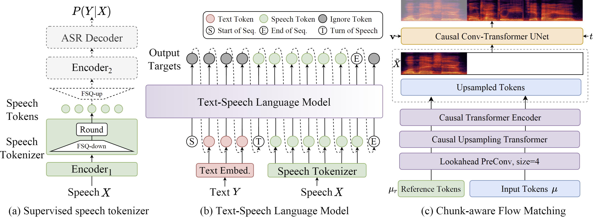
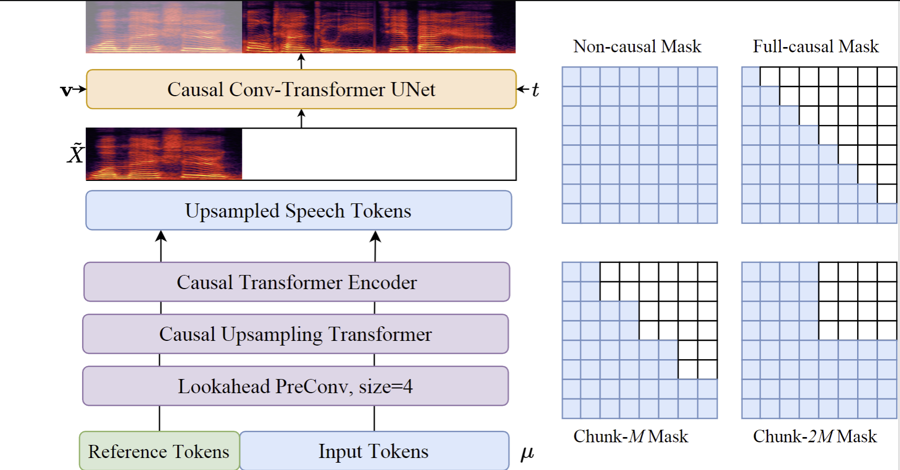
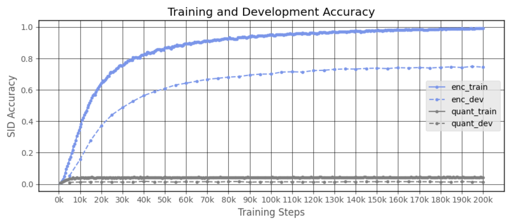
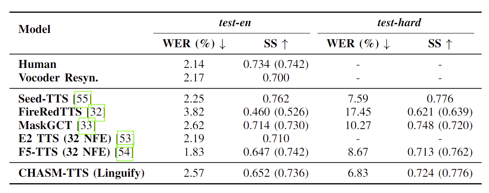

# Chunk-Aware Streaming Modular (CHASM)-TTS Model Agent Architecture System

Our proposed novel CHASM-TTS is a system that can convert written text to natural-sounding speech.

> [!NOTE]
> All architectures, frameworks, pipelines, models, and preprocessed datasets proposed are completely researched, designed, and implemented with complete success by the authors (Joseph Chay and Leong Tin Jet).

---

## Trained Models Files and Versions

For our agent model assets, config files, and versions, supplemented with usage 
implementation guides, refer to [Hugging Face model hub](https://huggingface.co/josephchay/Linguify).

---



Our architecture pipeline contains three main components. (a) supervised acoustic tokenizer, with dashed components active
only during training; (b) unified model handling both text and speech
inputs in streaming and non-streaming modes, with dashed arrows indicating
autoregressive decoding during inference; (c) causal flow matching framework
conditioned on speaker representation v, semantic tokens μ, masked acoustic
features ˜X, and intermediate latent variable Xt.



To enable streaming synthesis, which allows real-time, interruptable speech generation as text is being received, 
four specialized attention mask types are strategically implemented in
our model architecture. They control the information
flow within the attention mechanisms of the Transformer-based
components, creating different trade-offs between interruptable
and synthesis quality. The mask selection directly affects how
much future context each frame can access during generation:

- Non-causal Mask: Attends to all frames for offline mode 
- Full-causal Mask: Attends only to past frames for lowest
latency 
- Chunk-M Mask: Attends to past and M future frames 
- Chunk-2M Mask: Extends context for better quality at
higher latency

## Results and Discussions



Training was conducted with representations of Speaker
Identification (SID) task both before and after quantization, which is essential for zero-shot synthesis in Linguify where
voice characteristics should be independently controlled from
linguistic content itself. following methodologies similar to
those in speaker verification research.

Our accuracy curves results, clearly showing that the SID layer
with quantized tokens fails to converge (positive outcome).
This inability to learn speaker identification from the tokenized
representations provides strong evidence of the tokenizer’s
success in decoupling speaker information from speech content, 
essential for zero-shot synthesis systems where voice characteristics 
should be controlled independently from speech
content, which is supported by recent works.

## Evaluations and Testings


The t-SNE evaluations visualization illustrates the speech representations before
(a) and after (b) quantization for three different speakers from the dataset.
(c) presents the codebook utilization, displaying the token percentage across
speakers, with each bin containing 500 tokens.

### Ablations Studies and Benchmarking



Further evaluation was conducted on the commonly-used
SEED test sets: test-en (English), and test-hard (challenging cases). 
As shown in Table above, on the test-en set, it ranked
fourth in WER (2.57%) and third in SS (0.736), as other models are 
trained for longer durations and better GPU hardware. On the challenging
test-hard set, the model achieved SOTA performance with a
WER of 6.83% and SS of 0.776, demonstrating robustness in
difficult synthesis scenarios.

## Package Installation

```bash
# Install directly from GitHub
pip install git+https://github.com/josephchay/linguify.git
```

```bash
# Or for TTS component only
pip install "git+https://github.com/josephchay/linguify.git#egg=linguify[tts]"
```

## Setup & Development

### Clone the Repository

To install the CHASM-TTS system, you can use the following commands:

```bash
git clone https://github.com/josephchay/linguify.git
```

### Install Dependencies

```bash
cd linguify
pip install -e .
```

or for manual installation without `setup.py`:

```bash
cd linguify/TTS
pip install -r requirements.txt
```

## Basic Usage

To obtain default results, simply run the entire `inference.ipynb` notebook as provided.
This will execute the necessary steps to generate the expected output.

For extended inference techniques with more detailed control and customization,
refer to the `extended_inference.ipynb` notebook.

### Initialize the TTS system

```python
import torch

from src.core import Chat

chat = Chat()
chat.load_models(compile=False)  # Set to True for better performance
```

### Text Prompts

> [!NOTE]
> The model is also trained on generic information and can generate speech of equal quality for common topics.
>
> _Regarding textual abbreviation, each of them should be presented with spaced-out characters to ensure clarity and accurate interpretation._

```python
# Prepare your text
texts = [
  "<YOUR TEXT PROMPT HERE>",
  "<YOUR TEXT PROMPT HERE>",
  "<YOUR TEXT PROMPT HERE>",
]
```

### Generate Speech

```python
# Generate speech
wavs = chat.inference(texts, use_decoder=True)

torchaudio.save("audio_output1.wav", torch.from_numpy(wavs[0]), 24000)

# Play the audio (if in a notebook environment)
from IPython.display import Audio
Audio(wavs[0], rate=24_000)
```

## Advanced Usage

```python
# Sample a speaker from Gaussian.
rand_spk = chat.sample_random_speaker()
params_infer_code = {
  'spk_emb': rand_spk, # add sampled speaker
  'temperature': .3, # using custom temperature
  'top_P': 0.7, # top P decode
  'top_K': 20, # top K decode
}

# For sentence level manual control.

# use oral_(0-9), laugh_(0-2), break_(0-7)
# to generate special token in text to synthesize.
params_refine_text = {
  'prompt': '[oral_2][laugh_0][break_6]'
}

wav = chat.inference(texts, params_refine_text=params_refine_text, params_infer_code=params_infer_code)

# For word level manual control.
text = """Managing acute [uv_break]hypertensive crisis[uv_break] requires swift evaluation and intervention.
In cases of [uv_break]hypertensive emergency[uv_break] with end-organ damage, agents like [uv_break]labetalol[uv_break],
[uv_break]nicardipine[uv_break], or [uv_break]sodium nitroprusside[uv_break] are commonly administered intravenously.
[laugh]Not exactly your everyday headache cure![laugh] [uv_break]Careful titration[uv_break] is crucial to avoid
precipitous drops in blood pressure, which may lead to [uv_break]cerebral hypoperfusion[uv_break] or [uv_break]myocardial
ischemia.[uv_break] [laugh]That's one way to swap one crisis for another![laugh] [uv_break]For patients
with [uv_break]pheochromocytoma[uv_break], initiating alpha-blockade with agents like [uv_break]phenoxybenzamine[uv_break]
before beta-blockers is essential to prevent [uv_break]hypertensive rebound.[uv_break] [laugh]Getting those steps reversed?
Bad idea.[laugh] [uv_break]Ultimately,[uv_break] close hemodynamic monitoring and clinical judgment are key to
ensuring patient stability and recovery."""
wav = chat.inference(text, skip_refine_text=True, params_refine_text=params_refine_text,  params_infer_code=params_infer_code)
torchaudio.save("audio_output2.wav", torch.from_numpy(wavs[0]), 24000)
```

## Example Usage

```python
inputs_en = """
Patients presenting with [uv_break]tachyarrhythmia[uv_break] may require immediate intervention, particularly in
cases of [uv_break]ventricular fibrillation[laugh] oh, not ideal timing for that[laugh] [uv_break]where
synchronized cardioversion is indicated. [uv_break]Beta blockers like [uv_break]metoprolol[uv_break] or [uv_break]propranolol[uv_break] may
be administered, but [uv_break]contraindications such as [uv_break]bradycardia[uv_break] or [uv_break]severe asthma[uv_break] must be carefully assessed.
[laugh]You wouldn't want to mix those up![laugh] [uv_break]In critical scenarios, [uv_break]amiodarone[uv_break] or [uv_break]lidocaine[uv_break]
may be considered, ensuring [uv_break]continuous E C G monitoring[uv_break] to evaluate Q T interval prolongation risks. [uv_break]Ultimately,[uv_break]
clinical judgment is paramount, [uv_break]so tread carefully when managing complex arrhythmias.[uv_break]
""".replace('\n', '') # English is still experimental.

params_refine_text = {
  'prompt': '[oral_2][laugh_0][break_4]'
}
# audio_array_cn = chat.inference(inputs_cn, params_refine_text=params_refine_text)
audio_array_en = chat.inference(inputs_en, params_refine_text=params_refine_text)
torchaudio.save("audio_output3.wav", torch.from_numpy(audio_array_en[0]), 24000)
```

## Sample Audio Outputs

Prompt:

"Pharmacokinetic analysis indicates that the prescribed medication reaches peak plasma concentration within two hours,
with a half-life of approximately eight hours, necessitating bi-daily administration."

Output:

https://github.com/user-attachments/assets/b75f3872-6861-45dd-a109-39394b0f72d9

Prompt:

"Medical advancements in AI-driven diagnostics have significantly improved early cancer detection.
Techniques such as liquid biopsy and deep-learning-based imaging analysis enhance accuracy and patient outcomes."

Output:

https://github.com/user-attachments/assets/2cbeb712-a20a-47ee-957b-7b142652fa7d

The audio outputs above not only demonstrate natural-sounding speech but also showcase the system's ability to
handle complex medical terminology with ease, as well as pronouncing them in a very rich tone, with strong pause-like smoothing slurs.

## Features & Updates

Refer to the [CHANGELOG](CHANGELOG.md) file for the thorough latest updates and features of Linguify.

## License

This project is licensed under the MIT License - see the [LICENSE](../LICENSE.txt) file for details.

## Research Documentation Paper

For comprehensive information about our implementation details, methodology, and findings, please refer to our [research documentation](documentation.pdf) which thoroughly documents everything we've accomplished in this codebase.

## Citation

If you use this project in your research or application, please cite:

```bibtex
@inproceedings{chayleong2025linguify,
  author = {Joseph Chay and TinJet Leong},
  title = {Linguify: Self-Reflective Retrieval-Augmented Generation and
Chunk-Aware Streaming Modular TTS for Interruptable, Low-Latency
Chatbot Conversational AI},
  year = {2025},
  url = {https://github.com/josephchay/Linguify}
}
```

## Contact

For questions, suggestions, or issues related to this project, please contact the creators through [Hugging Face](https://huggingface.co/josephchay/Linguify) or open an issue in our GitHub [repository](https://github.com/josephchay/linguify).

---

## Previous Implementations

### Modelling

Although previous very earlier commits can be seen to have files like `gpt.py` and classes like `GPTWrapper`, 
especially their initial introduction in commit `cad8f01a320233df390784bc330a43a7c310a950``,
These are merely just implementation names (proven by the absence of any OpenAI API or external API usage).
It was previously named after as we were using a temporary Open Source [Minimized GPT](https://github.com/karpathy/minGPT) 
model architecture for our language processing components for initial evaluation and testing on CHASM-TTS.
The actual implementation is fully self-contained and uses our own trained and custom SR-RAG LLM for inference and generation.
