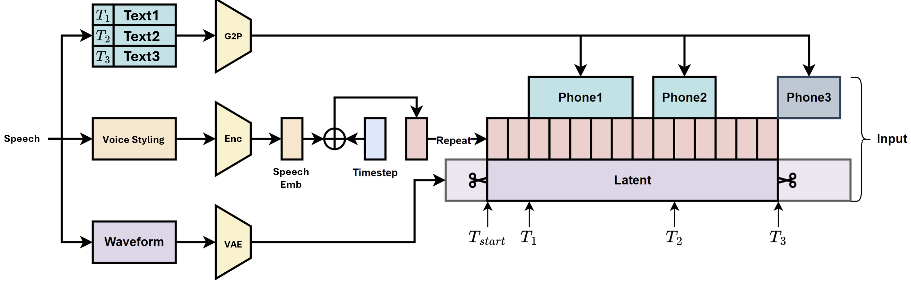

# Dataset Preprocessing, Cleaning, and Segregation

This directory contains scripts for preprocessing various datasets from 
Hugging Face into a standardized question-answer format, creating 
the comprehensive LinguifyDataset used for training Linguify's conversational AI models.

> [!NOTE]
> All architectures, frameworks, pipelines, models, and preprocessed datasets proposed are completely researched, designed, and implemented with complete success by the authors (Joseph Chay and Leong Tin Jet).

---

## Preprocessed, Cleaned, Segregated Dataset

For our own curated datasets, files and versions of over 30 million rows, 
supplemented with usage implementation guides, refer to [Hugging Face model hub](https://huggingface.co/josephchay/Linguify).

## Overview

The preprocessing, cleaning, and segregation scripts transform finance and 
medical datasets from various sources into a consistent format optimized for 
training Linguify's Self-Reflective Retrieval-Augmented Generation 
(SR-RAG) and Chunk-Aware Streaming Modular 
Text-to-Speech (CHASM-TTS). These scripts handle 
diverse input structures and standardize them to a uniform question-answer 
format to ensure high-quality training data.

> ![NOTE]
> All architectures, frameworks, pipelines of this repository are completely researched, designed, and implemented with complete success by the authors (Joseph Chay and Leong Tin Jet).


We proudly introduce a novel data preprocessing pipeline, where raw
data instances are first decomposed into discrete “Question”
and “Answer” components, enabling a structured transfor-
mation of unorganized inputs into agent-ready formats. This
facilitates targeted conditioning of the model architecture by
separately modeling input prompts and expected outputs, a
strategy shown to enhance alignment and downstream gener-
alization. The processed “Question” and “Answer” pairs
are then fed into our RAG model architecture, where an
integration mechanism synthesizes them into a representation
optimized for task-specific objectives.



We develop yet another approach for our data clearning and segregartion through
our automated pipeline for data cleaning
and segregation for speech data, through conditioning signals
at specific timesteps (Tstart, T1, T2, T3), synchronized with
the phonetic sequence:
Text Input Stream Multiple text inputs (T1, T2, T3)
undergo G2P conversion to phonetic representations (Phone1,
Phone2, Phone3), to ensure accurate pronunciation mapping.
Voice Styling Stream Reference speech is encoded through
Enc to extract embeddings, which combine with timestep
information via addition for temporal voice representation-
extending speaker conditioning approaches with
explicit temporal conditioning.
Waveform Stream Raw audio is compressed through a
VAE into latent representations, sharing conceptual founda-
tions with neural codec models while optimizing for
the multi-input architecture.

## Workflow

Processes multiple finance-related datasets from Hugging Face, transforming them into a standardized question-answer format. The script supports various data sources including instruction datasets, financial news, and social media discussions.

**Features:**

- Transforms datasets from financial, taxation, and medical instruction sets, news articles, and Reddit discussions
- Handles multiple input formats with specialized transformation functions
- Contains over 29 million rows of train and over 3 million rows of test splits with configurable ratios
- Exports in both HF Dataset and `.jsonl` formats for reproducibility.

## Usage Implmentation

All data is preprocessed into this standard format:

```json
{
  "question": "The input question or prompt",
  "answer": "The corresponding answer or response"
}
```

When exported to JSONL format:

```json
{
  "prompt": "The input question or prompt",
  "response": "The corresponding answer or response"
}
```

## Example Code

Loading the processed dataset:

```python
from datasets import load_from_disk

# Load a specific split
finance_dataset = load_from_disk("datasets/finance/train")
medical_dataset = load_from_disk("datasets/medical/train")

# Combine datasets if needed
from datasets import concatenate_datasets
combined = concatenate_datasets([finance_dataset, medical_dataset])

# View some examples
for i in range(3):
    print(f"\nExample {i+1}:")
    print(f"Question: {combined[i]['question'][:100]}...")
    print(f"Answer: {combined[i]['answer'][:100]}...")
```

## Customization

### Adding New Datasets

To add a new finance dataset, modify the `DATASETS_CONFIG` list in `preprocess_finance_dataset.py`:

```json
{
    "name": "new_dataset_name",
    "split": "train",
    "columns": ["input_col1", "input_col2"],
    "transform_type": "instruction"  # or another supported type
}
```

For medical datasets, add to the `DATASETS_CONFIG` in `preprocess_medical_dataset.py`:

```json
{
    "name": "new_medical_dataset",
    "split": "train",
    "rename_map": {"source_col": "question", "target_col": "answer"}
}
# Or for complex transformations:
{
    "name": "complex_dataset",
    "split": "train",
    "transform": [custom_transform_function],
    "remove_columns": ["col1", "col2"]
}
```

## License

This project is licensed under the MIT License - see the [LICENSE](../LICENSE.txt) file for details.

## Research Documentation Paper

For comprehensive information about our implementation details, methodology, and findings, please refer to our [research documentation](documentation.pdf) which thoroughly documents everything we've accomplished in this codebase.

## Citation

If you use this project in your research or application, please cite:

```bibtex
@inproceedings{chayleong2025linguify,
  author = {Joseph Chay and TinJet Leong},
  title = {Linguify: Self-Reflective Retrieval-Augmented Generation and
Chunk-Aware Streaming Modular TTS for Interruptable, Low-Latency
Chatbot Conversational AI},
  year = {2025},
  url = {https://github.com/josephchay/Linguify}
}
```

## Contact

For questions, suggestions, or issues related to this project, please contact the creators through [Hugging Face](https://huggingface.co/josephchay/Linguify) or open an issue in our [GitHub repository](https://github.com/josephchay/linguify).
